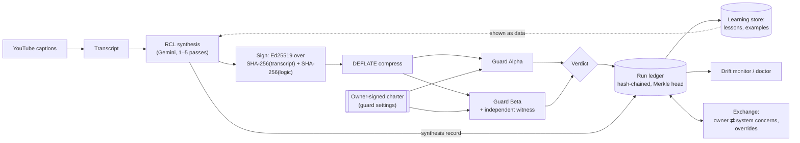

# AetherShell

Pull caption transcripts from YouTube, have Gemini derive an execution plan
("Innershell logic") from them, sign the transcript and the logic together,
and check the logic against the transcript before it is accepted
("Guard Shell").

## What is real and what is not

| Part | What it does |
| --- | --- |
| Ingestion | Fetches the video's **caption track** (`youtube-transcript-plus`). Playlists are listed with the YouTube Data API. A video without captions gets no transcript; nothing is generated. |
| Demo playlists | The two built-in playlists are **synthetic sample text** with placeholder video ids, labelled `[DEMO]` everywhere. |
| RCL/SSI | N real Gemini passes (1–5). Pass 1 drafts the logic; later passes revise it against the transcript. The per-pass numbers are **measured**: content-word overlap with the transcript and change from the previous pass. |
| Signing | Ed25519 signature (server-held key) over a manifest of SHA-256(transcript) and SHA-256(canonical logic JSON), made **before** DEFLATE compression. Public key at `GET /api/crypto/public-key`. |
| Guard Shell | Passes only if **all** hold: signature verifies and both hashes match; the compressed payload inflates to the exact watermarked text containing the exact transcript; lexical grounding meets the threshold; the Gemini review approves. If Gemini is unavailable the guard **fails closed**. Alpha measures word overlap, Beta word-pair overlap. |
| Independent witness | Guard Beta re-checks the signature, both digests and the compressed payload with `server/witness.ts`, a second implementation that shares no code with `server/provenance.ts` (own canonical-JSON encoder, own normalization, byte-level payload comparison). Beta passes only if the witness verifies and agrees with the primary check field by field; a disagreement is a refusal. Differential tests compare the two on thousands of random inputs. After Dharmapala's `witness.py`. |
| Lexical grounding | Overlap of vocabulary, not meaning. It catches invented terms; it cannot prove a paraphrase is faithful. That is what the LLM review is for, and that review is a model judgement. |
| Script sandbox | Model-written scripts and imported guard wrappers run in a sandboxed iframe (opaque origin, CSP `default-src 'none'`) inside a Worker with a 2 s timeout: no access to the page, cookies, storage or network. |
| GitHub guards | Only `raw.githubusercontent.com` is fetched (URL parsed and rebuilt, redirects refused). The guard's JS wrapper runs in the sandbox; the Gemini review runs on the server. Both must pass. |
| Presets | The "AetherShell: IMO AI & Information Entropy" preset lists four real 3Blue1Brown video ids; their transcripts are fetched from captions when you load it. |
| Playlist listing | With `YOUTUBE_API_KEY`: YouTube Data API (also gives upload dates). Without it: the playlist page is read for ids/titles/durations (best effort; YouTube may change that markup). |
| Video cards | Thumbnail from `i.ytimg.com/vi/<id>/mqdefault.jpg`, duration, and upload date. Upload dates need `YOUTUBE_API_KEY`; otherwise the card says "unknown". |
| Playlist export | Output Hub → "Export Playlist JSON": every video's signed manifest, DEFLATE-compressed transcript, and the exact logic signed with it, plus the signer's public key. The file re-checks each logic hash; videos not yet signed are listed as `not_signed`. |
| Guard charter (owner authority) | Every guard setting (grounding thresholds, whether model approval and the independent witness are required, which models may review) is in a charter signed with the **owner's** Ed25519 key, which never leaves the owner's machine. Without a valid charter the guards do not run; no environment variable can change a guard setting. Charters are versioned and chained, so a rollback, a fork, a skipped version or a hand edit is refused. Before signing a change, `npm run owner -- propose` asks the server for its assessment: what loosens, and which recorded verdicts would flip. Every accepted charter is entered in the run ledger with that assessment. A new owner key is accepted only if the previous key named it in a signed charter. |
| Exchange (owner ⇄ system) | Either side can raise a concern and the other owes it a reasoned answer, all in the ledger. The system raises concerns from the record by itself (its two verifiers disagreeing, guard-failure drift, the grounding check repeatedly rejecting what the model review approves) and, where useful, attaches a computed proposal; it can never change the guards. Owner concerns are answered by the system from the record via the model (if the model is down, the concern stays open). The owner can override a single verdict only after reading the system's assessment of it: the signed override must include that assessment's hash. Owner statements are signed, expire after 24 h and cannot be replayed. `npm run owner -- concerns / raise / answer / override`. |
| Run ledger | Every signing and every guard verdict the server produces is appended to `data/ledger.jsonl`: hash-chained, digests only. `GET /api/ledger/head` returns a signed head (size + Merkle root), `/api/ledger/proof/:seq` an inclusion proof, `/api/ledger/verify` the chain check. A ledger that fails verification on load is reported and not appended to. Ported from Dharmapala's run records. |
| Drift monitor | An anytime-valid e-process (from Dharmapala's `eprocess.py`) over guard failures in the ledger flags a failure rate credibly above `DRIFT_P0` (default 15%) at false-alarm level `DRIFT_ALPHA` (default 0.01). Runs where the model was unavailable are left out. |
| Doctor | `npm run doctor` (or `GET /api/doctor`) reports which layers are actually running: `ok`, `DEGRADED`, or `BLOCK`, each with the fix. Pattern from syndicate-genesis. |
| AetherTwin | Reads guard outcomes from the server's run ledger; it no longer accepts reports from the browser. The counterfactual tool replays observed Guard Alpha runs with a different grounding limit. It does not predict anything else. |
| Gemini usage | The Ingestion tab shows today's calls per model (quota day = Pacific, as Google's). Google does not report remaining quota, so a bar appears only when you state your limit (`GEMINI_DAILY_REQUEST_LIMIT`, from AI Studio → Rate Limit). When Google refuses a model with a **daily** quota error, the server stops calling that model until midnight Pacific and says so; `doctor` reports it. Counts are kept next to the ledger. `GET /api/gemini/usage`. |
| Snapshots | Memory → "Download Snapshot" saves the working state (memory, playlist, transcripts, signed watermarks, logic) as JSON; "Restore Snapshot" loads it after a confirmation. Guard verdicts are never restored from a file: the ledger is their record, so run the guards again. Old memory-only exports still import. The header shows when memory was last saved in this browser. |
| Learning (AetherTwin) | Each synthesis is recorded in the ledger (playlist, transcript and logic hashes, pass count, what it was shown). Guard verdicts on it then teach the next one: a rejection becomes a **lesson** (which checks failed, what the reviewer called unsupported), a pass by every guard becomes an **example**; the next synthesis of the same playlist is shown both, marked as data. With "Let AetherTwin choose" ticked, the pass count (1–5) is picked per playlist by a deterministic bandit (UCB1 over a pooled Beta prior) from the ledger alone. It learns only from logic this server synthesized; model outages and channel failures are not lessons; the owner's overrides win; every stored item is re-checked against the ledger when used, and `doctor` reports any that do not match. It never reads or changes the charter. Store: `data/learning.jsonl` (`AETHERSHELL_LEARNING_PATH`), a cache: deleting it loses lessons and examples, not evidence. `GET /api/learning`. |
| Model shells | With several models, each has its own shell: its record as a writer (pass rate, own lessons, own best pass count per playlist) and as a reviewer. The shared twin holds what the guards verified, for every model. Every lesson and example names its **writer** and **reviewer**, checked against the ledger, so a writer is shown "own" and "shared" lessons with their source, and a false source is caught. Pass counts are learned per writer, borrowing from the other models while a writer is new. With "Let AetherTwin choose the writer model", the writer is picked by the same rule from each model's record. Optimism is capped at a 100% pass rate, so a dearer setting is never explored while a cheaper one is already perfect. |

## How it fits together



Only the owner's key changes the charter. Everything else reads the ledger; nothing rewrites it.

## Models: Gemini, hosted, or open-source on your own GPU

Every model is named `provider:model` and set with `AETHERSHELL_MODELS`, tried in order:

| Provider | Set | Example model name |
| --- | --- | --- |
| Gemini | `GEMINI_API_KEY` | `gemini-flash-latest` (no prefix needed) |
| Local, open source (Ollama, llama.cpp, vLLM, LM Studio) | `LOCAL_LLM_BASE_URL`, e.g. `http://127.0.0.1:11434/v1` | `local:qwen3:8b`, `local:gemma3:12b` |
| OpenRouter (hosted open models) | `OPENROUTER_API_KEY` | `openrouter:qwen/qwen3-8b:free` |
| OpenAI or compatible | `OPENAI_API_KEY` (+ `OPENAI_BASE_URL`) | `openai:gpt-4.1-mini` |

Models of a provider that is not set up are skipped; `doctor` lists what can be
called. **The guard reviewers are the owner's choice**: they are the signed
charter's `reviewModels`, not this setting. With a local model and a charter that
still names Gemini reviewers, synthesis runs but the guards fail closed and
`doctor` says `BLOCK guard-review` until the owner signs a charter naming models
the server can call (`npm run owner -- propose / sign --set reviewModels=local:gemma3:12b`).
Prefer a different model family for review than for synthesis, so the reviewer
does not share the writer's blind spots. Voice input still uses Gemini's audio model.

Things that affect accuracy:

- **Context window (Ollama).** Ollama's default context is small (2-4K tokens) and
  it drops the start of a longer prompt without an error. A synthesis prompt
  carries up to 15,000 characters of transcript (~4K tokens) plus instructions,
  so start the server with a larger window: `OLLAMA_CONTEXT_LENGTH=16384 ollama serve`.
- **Every model is checked against the source, not against each other.** Each RCL
  pass sees the original transcript; the guards measure the final logic against
  the full transcript, whichever model (or mix of models, after a fallback) wrote
  it. The ledger records which model wrote each pass (`modelsUsed`) and which
  model reviewed each verdict (`reviewModel`).
- **A model that answers with invalid JSON is skipped** and the next model is
  tried; if none gives usable JSON the call fails closed.

## Proving when: Bitcoin-anchored timestamps

`npm run anchor -- run` records a manifest of the current commit (git HEAD and
tree hash, plus the author and licence from `package.json`) in `anchors/`,
chains it into `anchors/log.jsonl`, and submits its hash to the
[OpenTimestamps](https://opentimestamps.org) calendars. Within a few hours the
calendars commit it to a Bitcoin block; `npm run anchor -- upgrade` fetches that
proof into the `.ots` file. Anyone can then check, without trusting the author,
GitHub or this repository, that this exact code existed by that block's time:
`ots verify anchors/<id>.json.ots` (with a Bitcoin node), or `npm run anchor -- verify`
for the chain and digests offline.

Add `--ledger <ledger.jsonl>` to anchor the run ledger's head (size, last hash,
Merkle root) as well; a ledger that fails verification is refused. Only hashes
leave the machine. Needs the `ots` client: `pip install opentimestamps-client`.
Exit codes: 0 done, 1 needs a human, 2 calendars unreachable (state unknown, not
"unconfirmed"). Same design as syndicate-genesis's `tools/anchor.py`.

A timestamp proves existence by a date. It does not by itself prove who wrote
the code, or that nobody had the idea earlier.

## Running locally

```bash
npm install
cp .env.example .env   # set GEMINI_API_KEY at least
npm run dev            # http://127.0.0.1:3000
```

* `npm run owner -- keygen`, then `npm run owner -- init --key <key> --reason "..."`: set up your owner key and first guard charter (guards stay off until you do).
* `npm run doctor`: what is configured and what is degraded, before you trust a run.
* `npm test`: unit tests (signing/verification, tamper cases, URL validation, caption grouping, grounding).
* `npm run lint`: TypeScript check.
* `npm run build && NODE_ENV=production npm start`: production build.

## License

Copyright (C) 2026 Nicholas Clifford Maino.

AetherShell is free software: you can redistribute it and/or modify it under the
terms of the GNU Affero General Public License, version 3 only (AGPL-3.0-only),
as published by the Free Software Foundation. See [LICENSE](LICENSE).

In short: you may use, study, change and share it; if you run a modified version
for others over a network, you must offer them its source under the same licence.

## Deploying

Set `AETHERSHELL_SIGNING_KEY` (otherwise signatures do not survive a restart)
and `AETHERSHELL_ACCESS_TOKEN` (otherwise anyone who can reach the server can
spend your Gemini quota). The rate limiter is in-memory and per-instance. See
`.env.example` for every setting.
